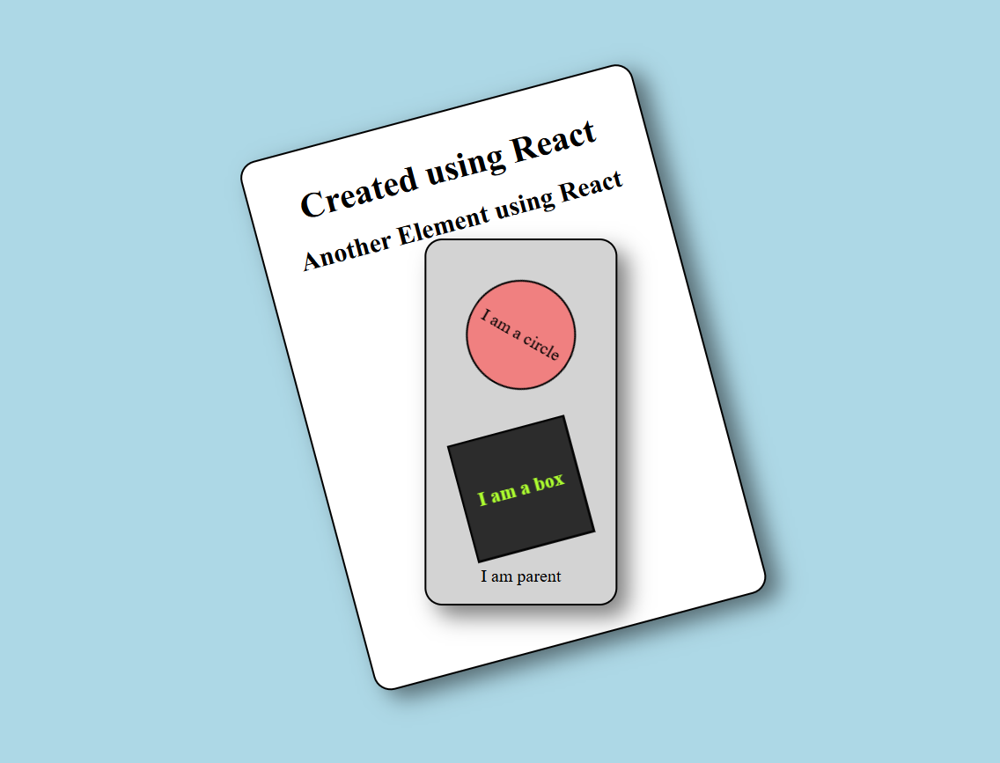

# ⚛️ React Day 01 – Core Basics without JSX

This is my **Day 01 React learning project** where I explored how React works **without JSX**, using `React.createElement`.

---

## 📸 Day 01 Preview

---

## 🧠 What I Learned
- How React works without JSX
- Using `React.createElement`
- Creating nested components
- Import / Export modules
- Rendering using `ReactDOM.createRoot`
- Component composition (Parent, Box, Circle)
- Basic styling & hover animations

---

## 📂 Files Overview
- `script.js` – Main render logic
- `parent.js` – Parent component
- `app.js` – Circle component
- `test.js` – Box component
- `style.css` – Styling & animations

